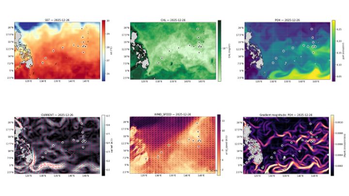

# Daily Near-Real-Time Ocean Context for the CRESST Expedition


This repository generates daily, near-real-time maps for the **CRESST student research cruise** (UW CoEnv):

- Sea Surface Temperature (SST) — Simons CMAP (AVHRR OI NRT)
- Chlorophyll-a, PAR, AOD — Simons CMAP (MODIS)
- Sea Level Anomaly (SLA) + surface geostrophic currents — Copernicus Marine (DUACS)
- Biogeochemistry Fe, NO3, PO4, Si (model analysis) — Copernicus Marine
- 10 m winds (daily-mean from hourly) — Copernicus Marine

The goal is to produce **quick-look, reproducible visualizations** to support situational awareness during the expedition.

---

## Installation

### 1) Create the conda environment

```bash
conda env create -f cresst-cruise.yml
conda activate cresst-cruise
```

### 2) Provide credentials (recommended: environment variables)

This project expects:

- `CMAP_API_KEY` (Simons CMAP)
- `COPERNICUSMARINE_USERNAME` / `COPERNICUSMARINE_PASSWORD` (Copernicus Marine)

Example (bash/zsh):

```bash
export CMAP_API_KEY="..."
export COPERNICUSMARINE_USERNAME="..."
export COPERNICUSMARINE_PASSWORD="..."
```

---

## Quick start

Generate plots for yesterday (default):

```bash
python daily_plots.py
```

Generate plots for a specific date:

```bash
python daily_plots.py --date 2025-12-20
```

Customize the geographic bounding box:

```bash
python daily_plots.py --bbox 2 120 22 150
```

Overlay stations from a CSV (`lat,lon` columns):

```bash
python daily_plots.py --stations stations.csv
```

Create a zip archive of the figure directory:

```bash
python daily_plots.py --zip
```

---

## Outputs

By default outputs are written under `./output/`:

- `output/figs/YYYYMMDD/*.png` (plots)
- `output/data/YYYYMMDD/*/*.nc` (cached Copernicus NetCDF subsets)
- `output/figs/YYYYMMDD.zip` (optional)

---

## Adding / changing CMAP datasets

Edit `DEFAULT_CMAP_DATASETS` in `daily_plots.py`:

```python
DEFAULT_CMAP_DATASETS = {
    "tblSST_AVHRR_OI_NRT": {"variables": ["sst"], "units": ["°C"]},
    "tblModis_CHL_NRT": {"variables": ["chlor_a"], "units": ["mg/m³"]},
}
```

Notes:
- The plotting code expects gridded fields that can be pivoted onto a regular lat/lon grid.
- Chlorophyll is plotted on a log scale by default.

---

## Automation (optional)

To generate plots daily on a shipboard laptop/server, you can set up a cron job.
Example (runs every day at 07:15 local time):

```cron
15 7 * * * /path/to/miniconda/envs/cresst/bin/python /path/to/repo/daily_plots.py --zip >> /path/to/repo/cron.log 2>&1
```

---

## Troubleshooting

- **Empty plots / missing data**: many NRT products lag by ~1 day. Try `--date yesterday` (default).
- **Copernicus auth errors**: confirm your Copernicus Marine credentials and that your account is active.
- **Slow first run**: Cartopy may download Natural Earth shapefiles on first use.

---

## License

[](https://creativecommons.org/licenses/by/4.0/)

This repository is licensed under the **Creative Commons Attribution 4.0 International License (CC BY 4.0)**.

You may share and adapt this work for any purpose, even commercially, **as long as you provide appropriate attribution**.

See the license:
- https://creativecommons.org/licenses/by/4.0/